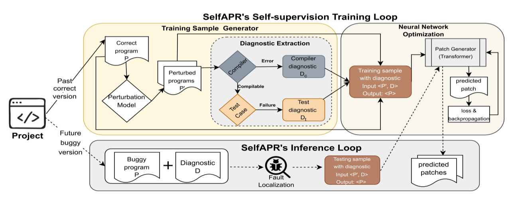

# SelfAPR: Self-supervised Program Repair with Test Execution Diagnostics

repo of "SelfAPR: Self-supervised Program Repair with Test Execution Diagnostics" (ASE 22) https://oadoi.org/10.1145/3551349.3556926



此工具采用自监督学习策略，通过扰乱原有的已修复的程序以制造训练样本，然后执行所有训练样本，将生成的诊断信息提取出来，与错误程序一并作为输入，以原有正确程序作为输出，对模型进行训练。  

扰乱规则如下：

|	Perturb Actions	| Explanation |
|	---	|---	|
|	P1 Replace type	|modify declaring type ... |
|	P2 Replace operator	| modify operator ==, !=, etc|
|	P3 replace literal	| modify literal, "STRING", true, false |
|	P4 replace constructor	| modify constructor |
|	P5 replace variable	| modify arguments/swap argumens |
|	P6 replace condition expression	| reduce/expand boolean expression|
|	P7 replace invocation	| modify invocation |
|	P8 compound statement	| compound of rules|
|	P9 replace with similarity	| replace by transplanting a similar donor statement|
|	P10 move statement	| move a later statement before the target statement |
|	P11 transplatant statement	| transplanting a donor statement |
|	P12 transplatant condition	|  wrap target statement with an existing conditional block|
|	P13 transplatant a block	| insert an existing block (if, loop, etc)|
|	P14 remove a statement	| delete statement |
|	P15 unwrap a statement	| unwrap block |
|	P16 remove a block	| remove block |


## Prerequisites:
Defects4J数据集：https://github.com/rjust/defects4j 
 ```
export PATH=$PATH:"path2defects4j"/framework/bin
 ```
JDK 1.8
 ```
export JAVA_HOME=/usr/lib/jvm/java-1.8.0-openjdk-amd64
export PATH=$JAVA_HOME/bin:$PATH
export CLASSPATH=.:$JAVA_HOME/lib/dt.jar:$JAVA_HOME/lib/tools.jar
 ```
 
python prerequisities:
 ```
pip3 install -r requirements.txt
 ```

## Building the Java code

 ```
cd perturbation_model
mvn package assembly:single
```
check perturbation-0.0.1-SNAPSHOT-jar-with-dependencies.jar with different options:
```
java -jar perturbation-0.0.1-SNAPSHOT-jar-with-dependencies.jar path Options=SelfAPR|BugLab|test
```
With option SelfAPR: we perturb with all 16 rules in SelfAPR (Then the perturbation-based samples are executed).  
With option BugLab: we perturb with all 16 rules in BugLab (No execution will be conducted).  
With option test: we extract context information for testing samples.  


##  Code perturbation scripts

#### 扰乱启动！
```
python3  1_perturb_projects.py
```
#### 执行扰乱后的程序样本
```
python3  2_execute_perturbation.py
```
#### 从Defects4J准备test data:

```
python3 3_prepare_test_data.py
```

#### 模型训练
```
pip install transformers
pip install sentencepiece
python3 4_train.py
```

#### 测试模型
```
python3 5_test.py
```

#### evaluation
```
python3 6_evaluate_patch.py
```


