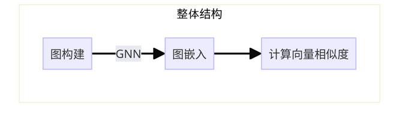

# Graph-based code clone detection

## 引言

在软件工程领域，代码克隆检测是一项至关重要的任务，它涉及到识别和分析源代码中的相似或重复的片段。代码克隆不仅会导致软件维护成本的增加，还可能影响软件的质量和安全性。代码克隆通常可以分为以下四类[^2][^7][^8][^9][^13]：

​	Type-1: 除了空格和注释之外，其他部分完全相同。

​	Type-2: 在Type-1的基础上，只有标识符、类型以及字面值不同。

​	Type-3: 在Type-2的基础上，在语句层面存在不同，即可能有语句被添加、删减、修改。

​	Type-4: 在语法上不相似，但功能相同。

Type-3与Type-4的界限往往并不明确，在BigCloneBench[^10]中，这两种类型被进一步被分为三种：strong type-3, moderately type-3以及weak type-3/type-4。weak type-3/type-4通常被称为语义克隆(semantic clone)，其他类型则统称语法克隆(syntactic clone)。

传统的基于文本/token的检测方法，如SourcererCC[^11], CCAligner[^12]主要依靠检测代码词法信息来判断是否相似，因此在语法克隆检测上具有良好的表现，但在语法克隆检测上表现不佳。与抽象语法树(AST)的代码克隆检测方法，可以高效地检测语法相似的代码，却难以捕捉到代码的语义信息。因此，一种方法是将代码转换为带有语义信息与语法信息的图，并通过基于图的方法比对图之间的相似度来进行代码克隆检测。

本文旨在综述基于图的代码克隆检测技术的现状与发展。基于图的代码克隆检测技术大多数基于图构建、图表征学习以及根据向量计算相似度的过程。

现有的方法多在前两步差异较大，在相似度计算上多采用直接计算图嵌入向量的相似度（如余弦相似度）的方法，因此我们将首先介绍图构建，然后探讨图表征学习的方法，并在最后通过案例分析介绍基于图的代码克隆的一些具体实现。

## 图构建

在基于图的方法中，代码图的构建是核心步骤，它将源代码转换为图结构，以便后续的特征提取。这一部分将详细介绍代码图的构建过程，包括节点和边的定义，以及如何从源代码中提取这些元素。

### 节点 (Nodes) 的定义与提取

节点通常代表代码中的各种元素，如变量声明、函数定义、类、控制流语句等。在代码图中，每个这样的元素都会被表示为一个节点。节点的提取过程涉及解析源代码并识别出所有可能的代码结构单元。例如：

- 变量节点：代表代码中的变量声明，节点的属性可能包括变量类型、作用域等。
- 函数节点：代表函数或方法，节点的属性可能包括函数的返回类型、参数列表、访问权限等。
- 控制流节点：代表控制流语句，如循环、条件判断等，节点的属性可能包括循环类型、条件表达式等。

### 边 (Edges) 的定义与提取

边在代码图中表示节点之间的关系，这些关系可以是数据依赖、控制依赖或其他类型的语义关联。边的提取需要分析代码的执行流程和数据流向。例如：

- 数据依赖边：表示数据从一个节点流向另一个节点，如变量赋值、函数参数传递等。
- 控制依赖边：表示一个节点的执行依赖于另一个节点的结果，如条件判断后的代码块执行。
- 调用边：表示函数调用关系，从一个函数节点指向被调用的函数节点。

### 代码的常见图表示

代码的常见图表示包括抽象语法树（Abstract Syntax Tree, AST）、控制流图（Control Flow Graph, CFG)与程序依赖图（Program Dependency Graph）。抽象语法树展现了代码的语法结构，其中树叶节点代表变量或常量，内部节点代表运算符或其他抽象结构，边则不具有具体含义。抽象语法树虽然能够表示代码的结构与语法信息，但由于缺少控制流与数据流的直接表示，难以从中直接提取语义信息；控制流图中，每个节点代表一条执行语句，节点之间的有向边代表程序的执行流；程序依赖图则可以视作在控制流图的基础上添加数据依赖边与执行依赖边。

## 图表征学习

图表征学习是指从图结构中提取高级特征的过程。图表征学习可以大致分为图嵌入与图核方法两种。图嵌入指将图嵌入一个低维向量空间，用得到的向量表示图上的特征；图核方法则只需要指定核函数，通过核函数直接计算数据点对的相似性。这里我们主要关心图嵌入。图嵌入的过程主要包括节点嵌入和整图嵌入。图神经网络（GNN）的目的就是学习每个节点的状态嵌入，再通过一个读出函数(readout function)整合局部信息获取整图嵌入。

节点嵌入是为图中的每个节点生成一个固定长度的向量。这个向量应该能够捕捉节点的属性和它与邻点之间的关系。因此，在节点嵌入的过程中需要充分利用图上的邻接关系，使嵌入向量能够聚合邻点与节点自身的特征。在GNN中，通常利用邻点与边的特征与状态来更新节点自身的状态。节点特殊的初始化通常使用one-hot或随机初始化完成。

### GraphSAGE(Graph Sample and Aggregation)[^14]

GraphSAGE的核心思想在于，利用邻居的采样子集的特征进行更新：

$h_v^{(t+1)} = \sigma\left(W^{(l)}\cdot \left[h_v^{t} || \left(AGG_t (h_u^{(t)}), \forall{u \in \mathcal{N}(v)}\right)\right]\right)$

其中$h_v^{(t+1)}$表示节点$v$在第$t+1$次迭代后的状态，$\sigma$表示激活函数，$ \mathcal{N}(v)$表示$v$的邻居采样子集，$W^{l}$为经过$l$次迭代后的权重矩阵，$AGG_t$为聚合函数，通常为平均聚合函数。

### GMN(Graph Matching Network)[^15]

GMN可以联合学习两张图的节点嵌入。除去传统GNN利用邻居更新状态，GMN加入了跨图注意力机制，使得节点可以从另一张图中的相似节点中也学习到特征。

$m_{j \to i} = f_{\text{message}}(h^{(t)}_i, h^{(t)}_j, e_{ij}), \quad \forall (i, j) \in E_1 \cup E_2$

$\mu_{j \to i} = f_{\text{match}}(h^{(t)}_i, h^{(t)}_j), \quad \forall i \in V_1, j \in V_2 \text{ or } i \in V_2, j \in V_1$

$h^{(t+1)}_i = f_{\text{node}}(h^{(t)}_i, \sum_{j} m_{j \to i}, \sum_{j'} \mu_{j' \to i}), \quad \forall i \in V$

$m_{j \to i}$表示边$ij$上传递的信息。$f_{match}$为跨图注意力机制，定义如下：

$a_{j \to i} = \frac{\exp(s_h(h^{(t)}_i, h^{(t)}_j))}{\sum_{j'} \exp(s_h(h^{(t)}_i, h^{(t)}_{j'}))}$

$\mu_{j \to i} = a_{j \to i} (h^{(t)}_i - h^{(t)}_j)$

$a_{j \to i}$为$i$对$j$的注意力权重，$s_h$用以衡量两个节点之间的相似度，一般使用内积。

### GAT(Graph Attention Network)[^16]

GAT通过以下公式计算节点之间的注意力分数：

$e_{ij} = a(Wh_i, Wh_j)$

然后利用标准化后的注意力权重更新节点状态：

$\alpha_{ij} = softmax(e_{ij}) = \frac{\exp(\text{LeakyReLU}(a^T \left[Wh_i || Wh_j\right]))}{\sum_{k \in \mathcal{N}(i)} \exp(\text{LeakyReLU}(a^T \left[Wh_i || Wh_k\right]))}$

$h_i^{t+1}=\sigma\left( \sum_{j \in \mathcal{N} } \alpha_{ij} Wh_j\right)$

## 案例分析

### funcGNN[^1]

funcGNN通过学习CFG的嵌入向量来预测程序对之间的图编辑距离(Graph Edit Distance, GED)，然后根据GED估计代码之间的相似度。

#### 方法

funcGNN分为自顶向下与自顶向上两种方法。首先使用GraphSAGE为CFG $G_i$与$G_j$中的每个节点生成节点嵌入$U_i,U_j$。

##### 自顶向下方法

在自顶向下方法中，使用全局注意力机制为图中更具有结构意义的节点赋予更大的权重，并通过求和加权的节点嵌入获取图嵌入$h_i$与$h_j$。然后使用Neural Tensor Network (NTN)计算图嵌入之间的多维关系。

##### 自底向上方法

在自底向上方法中，funcGNN通过计算$U_i$与$U_j$中成对节点的嵌入内积来获取跨图节点之间的相似性，并将结果通过直方图的形式（即区间统计）转化为向量。在连接NTN的输出与直方图后，将获取的新向量通过全连接层，最后获得程序对的估计GED。

### FA-AST[^2]

在[^2] 中，作者提出了结合图神经网络（GNN）和流增强的抽象语法树（FA-AST）来检测代码克隆。FA-AST是一种新型的代码表示方法，它在传统的AST基础上增加了控制流和数据流的信息，以更全面地捕捉代码的语义。

#### 方法

##### 预处理

一方面，一般来说程序的AST边数远多于CFG，使得AST能够更好地完成节点中的信息传递；另一方面由于CFG中的节点均为语句而非单个token，直接对语句做简单嵌入会导致丢失语义信息，而为每个节点构造子图则会增加神经网络规模。因此使用AST为基础，同时为了添加足够的语义信息，在AST中添加代表控制流与数据流的边，最终获取FA-AST(Flow-Augmented AST)。

##### 图嵌入

文章对比了使用两种GNN进行图嵌入的效果：GGNN(Graph Gated Neural Network)与GMN(Graph Matching Network)。在BigCloneBench数据集上，FA-AST+GMN取得了比FA-AST+GGNN更高的准确率、召回率与F1分数。

### Graph4CCDetector[^3]

 [^3]的动机在于，现有的代码克隆检测方法利用代码表示不充分，无法有效学习到语义信息。CFG与PDF虽然可以表示代码的控制流与执行流，但大粒度的节点做one-hot 或随机初始化会导致丢失节点内部的局部语义。因此提出了PNIAT layer以捕捉节点内部的语义信息。

#### 方法

##### 预处理

在预处理阶段，会保存CFG/PDG的节点与边对应的label，并做word embedding。此时可以发现节点的feature形状由于token数量不同而不一致，这个问题会在PNIAT中解决。

##### 图嵌入

首先使用PNIAT(para进行节点嵌入。PNIAT的目的有两个：一是规整在预处理阶段形状不相同的各个节点，二是通过注意力机制捕捉节点内部重要的token以获取节点所代表的语义信息。

PNIAT通过在节点内利用多头共享注意力机制(Shared Attentional Mechanism)综合token的feature获取节点嵌入。通过训练上下文向量矩阵$W$在节点内部实现全局注意力机制。

在完成了节点的初始嵌入后，使用两层GAT与EdgePooling提取高级特征。其中GAT主要负责节点与邻居之间的信息传递，EdgePooling负责合并节点实现池化。

最后通过GlobalAttention作为读出函数获取整张图的图嵌入。

##### 分类器

在获取了图嵌入后，相比于直接计算两个图嵌入之间的相似性，本文中使用BiLSTM与线性层组成的二分类器以更加高效与有效地计算两个图嵌入之间关系，而不像大多数方法直接基于距离计算相似度方法需要探索阈值的选择。

### GraphCodeBERT[^4]

由于本模型并非GNN模型，而且属于预训练大模型难以复现，因此只对核心方法做简单介绍。

GraphCodeBERT的核心思想是将数据流整合进语言模型中，通过代码-变量序列之间的代表数据流关系的边做masked attention，以获得关于语义结构的信息。预训练任务在masked language modeling (MLM)的基础上添加了Edge Prediction和Node Alignment：前者mask 20%在变量序列之间代表依赖关系的边进行pre-train，后者mask 20%在变量序列与代码之间代表标量来源的边进行pre-train。

### 其他[^5]

[^5] 通过计算子图同构的Weisfeiler-Lehman (WL)核方法计算图中相似节点的数量，并根据相似节点的数量计算图的相似度。

## 参考文献

[^1]: Nair, Aravind, Avijit Roy, and Karl Meinke. “funcGNN: A Graph Neural Network Approach to Program Similarity.” In *Proceedings of the 14th ACM / IEEE International Symposium on Empirical Software Engineering and Measurement (ESEM)*, 1–11, 2020. https://doi.org/10.1145/3382494.3410675.
[^2]: Wang, Wenhan, Ge Li, Bo Ma, Xin Xia, and Zhi Jin. “Detecting Code Clones with Graph Neural Network and Flow-Augmented Abstract Syntax Tree.” In *2020 IEEE 27th International Conference on Software Analysis, Evolution and Reengineering (SANER)*, 261–71, 2020. https://doi.org/10.1109/SANER48275.2020.9054857.
[^3]: Yu, Dongjin, Quanxin Yang, Xin Chen, Jie Chen, and Yihang Xu. “Graph-Based Code Semantics Learning for Efficient Semantic Code Clone Detection.” *Information and Software Technology* 156 (April 1, 2023): 107130. https://doi.org/10.1016/j.infsof.2022.107130.
[^4]: Guo, Daya, Shuo Ren, Shuai Lu, Zhangyin Feng, Duyu Tang, Shujie Liu, Long Zhou, et al. “GraphCodeBERT: Pre-Training Code Representations with Data Flow.” arXiv, September 13, 2021. https://doi.org/10.48550/arXiv.2009.08366.
[^5]: Zou, Yue, Bihuan Ban, Yinxing Xue, and Yun Xu. “CCGraph: A PDG-Based Code Clone Detector with Approximate Graph Matching.” In *Proceedings of the 35th IEEE/ACM International Conference on Automated Software Engineering*, 931–42. ASE ’20. New York, NY, USA: Association for Computing Machinery, 2021. https://doi.org/10.1145/3324884.3416541.
[^6]: Cassagne, Julien, Ettore Merlo, Paula Branco, Guy-Vincent Jourdan, and Iosif-Viorel Onut. “Unsupervised Graph Neural Networks for Source Code Similarity Detection.” In *Discovery Science*, edited by Albert Bifet, Ana Carolina Lorena, Rita P. Ribeiro, João Gama, and Pedro H. Abreu, 535–49. Lecture Notes in Computer Science. Cham: Springer Nature Switzerland, 2023. https://doi.org/10.1007/978-3-031-45275-8_36.
[^7]: C. K. Roy and J. R. Cordy, “A survey on software clone detection research,” Queenâ  ̆ A ́ Zs School of Computing TR, vol. 541, no. 115, pp. 64–68, 2007.
[^8]:R. Koschke, R. Falke, and P. Frenzel, “Clone detection using abstract syntax suffix trees,” in 2006 13th Working Conference on Reverse Engineering, IEEE, 2006, pp. 253–262. doi: 10.1109/WCRE.2006.18.
[^9]: Zakeri-Nasrabadi, Morteza, Saeed Parsa, Mohammad Ramezani, Chanchal Roy, and Masoud Ekhtiarzadeh. “A Systematic Literature Review on Source Code Similarity Measurement and Clone Detection: Techniques, Applications, and Challenges.” arXiv.org, June 28, 2023. https://arxiv.org/abs/2306.16171v1.
[^10]: F. Scarselli, M. Gori, A. C. Tsoi, M. Hagenbuchner, and G. Monfardini, “The graph neural network model,” IEEE Transactions on Neural Networks, vol. 20, no. 1, pp. 61–80, 2008.
[^11]:Hitesh Sajnani, Vaibhav Saini, Jeffrey Svajlenko, Chanchal K. Roy, Cristina V. Lopes, SourcererCC: Scaling code clone detection to big-code, in: 2016 IEEE/ACM 38th International Conference on Software Engineering, ICSE, 2016, pp. 1157–1168, http://dx.doi.org/10.1145/2884781.2884877.
[^12]:Pengcheng Wang, Jeffrey Svajlenko, Yanzhao Wu, Yun Xu, Chanchal K. Roy, CCAligner: A token based large-gap clone detector, in: Proceedings of the 40th International Conference on Software Engineering, ICSE ’18, Association for Computing Machinery, New York, NY, USA, 2018, pp. 1066–1077, http: //dx.doi.org/10.1145/3180155.3180179.
[^13]:Ain, Qurat Ul, Wasi Haider Butt, Muhammad Waseem Anwar, Farooque Azam, and Bilal Maqbool. “A Systematic Review on Code Clone Detection.” *IEEE Access* 7 (2019): 86121–44. https://doi.org/10.1109/ACCESS.2019.2918202.
[^14]: Will Hamilton, Zhitao Ying, and Jure Leskovec. 2017. Inductive representation learning on large graphs. In Advances in neural information processing systems. 1024–1034.
[^15]: Y. Li, C. Gu, T. Dullien, O. Vinyals, and P. Kohli, “Graph matching networks for learning the similarity of graph structured objects,” in International Conference on Machine Learning, 2019, pp. 3835–3845.
[^16]: Petar Veličković, Guillem Cucurull, Arantxa Casanova, Adriana Romero, Pietro Liò, Yoshua Bengio, Graph attention networks, 2018, arXiv:1710.10903 [stat.ML].
