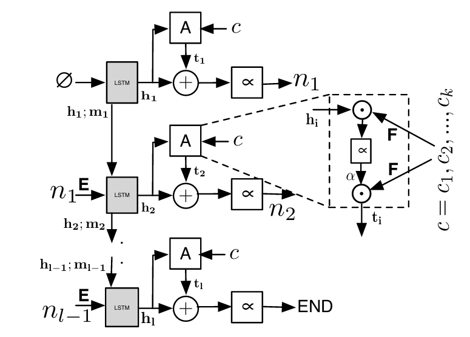

# Graph-based Code Summarization

### 引言

源代码摘要是编写源代码的自然语言描述的任务。这个概念约在2009年提出[^15]。这些摘要的主要用途是在程序员的文档中。这些摘要的自动生成是一个高价值的研究目标，因为程序员自己编写需要花费许多时间。

当时，这些都是由关键字提取技术主导的，比如使用tf/idf或类似的指标对文档中的前n个单词进行排名。一个被广泛接受的实践是使用源代码周围的上下文[^17]来帮助这个过程。[^16]随着编码器-解码器架构的神经模型的引入(例如，seq2seq, graph2seq)[^18]，这类在2017年左右基本上被搁置了。现在，带有注意力机制的神经网络模型[^21]成为主流。

目前，有关工作集中在**如何预处理数据**以用于现有的神经网络模型：

1. 更好的代码本身模型[^5][^19]，以及
2. 包含上下文信息的模型[^9]

常见工作主要包含三个步骤：

1. 数据的预处理。比如把AST通过不同的遍历方式[^2][^13][^14]转换成不同的输入序列，或将源代码的预测结果结合上下文内容等[^3][^8]。
2. 模型训练。常见的基础模型例如LSTM[^20]。
3. 测试与评估。常用的评估指标有BLEU[^22]、METEOR[^23]等。

### 案例分析

#### CODE-NN(Summarizing Source Code using a Neural Attention Model 2016 ACL)[^1]

##### 概要

CODE-NN模型是一种端到端生成系统，结合了内容选择和表面实现。它为C#和SQL语言代码片段生成自然语言摘要。它使用基于注意力的神经网络来模拟给定代码片段的自然语言摘要的条件分布。该方法涉及一个以注意力为引导的LSTM模型，逐字生成摘要。神经网络计算摘要的概率，作为条件下一个单词概率的乘积，并使用嵌入矩阵以及LSTM单元进行文本生成。

##### 数据集

模型训练和测试所使用的[数据](https://github.com/ sriniiyer/codenn)来源于StackOverflow，数据集包含了C#和SQL对。为处理来自StackOverflow的非正式且有时不完整的代码片段，使用了经过修改的ANTLR解析器和python-sqlparse来解析代码。解析后的代码片段进一步加工，以准备用于训练CODE-NN模型的数据集。

#### DeepCom(Deep code comment generation ICPC 2018)[^2]

DeepCom提出了一种新方法，用于为Java方法自动生成代码注释。它利用自然语言处理（NLP）技术和深度神经网络来分析Java方法的结构信息，以生成更好的注释。该方法从大型代码语料库中学习，并根据学习到的特征生成注释。
	DeepCom将代码注释生成任务视为机器翻译任务。使用基于序列的模型自定义处理从源代码中提取的结构信息，为Java方法生成摘要。DeepCom引入一种新的AST遍历方法，称为基于结构的遍历（SBT)，以更好地处理词汇表外标记。

Deepcom整体的模型基于Seq2Seq模型来学习源代码并生成注释，该模型由三个组件组成，一个编码器、一个解码器和一个注意力组件，其中编码器和解码器都是LSTM。

对语法树进行普通的前序遍历生成的序列无法完整包含语法树所含有的信息，具有二义性；DeepCom采用基于结构的遍历方法产生模型输入序列，消除了二义性，使代码摘要生成的结果更为精准。

##### 数据集

DeepCom在来自GitHub的9,714个开源项目构建的大规模Java语料库上进行了评估。[数据]([xing-hu/DeepCom (github.com)](https://github.com/xing-hu/DeepCom))

#### Project-Level Encoding for Neural Source Code Summarization of Subroutines 2021 ICPC[^3]

##### 概要

程序理解方面的经验研究非常清楚地表明，描述代码所需的信息通常以围绕该代码的函数调用图的形式存在于上下文中。本研究提出了一种项目级编码方法，用于改进神经源代码总结技术，通过提供软件项目上下文信息，提高了现有模型的性能。

该项目级编码器创建了选定软件项目中代码文件的向量化表示，为编码器-解码器模型提供上下文。这种方法旨在解决现有模型[^4][^5][^6][^7]的局限性——摘要仅基于传递给编码器的代码生成。通过整合项目上下文，模型获得对软件项目更广泛的理解，从而导致更全面的摘要。项目编码器旨在通过提供额外的上下文信息来补充现有的编码器-解码器方法，而不是取代它们。

##### 方法

神经编码器-解码器架构涉及两个分别对应平行数据的向量化表示，如句子翻译、图像和标题翻译，或者子程序和自然语言摘要。编码器-解码器模型旨在从一个数据生成另一个数据，例如从子程序生成摘要。编码器处理输入端，解码器处理输出端。该架构源自2014年Sutskever等人的工作，并随各种应用而发展，并依赖于注意机制来链接编码器和解码器的表示。该论文通过将一个单独的注意机制应用于整个项目编码器，引入了对注意机制的改进，从而使模型能够从软件项目中的局部和全局上下文中学习。

#### Function Call Graph Context Encoding for Neural Source Code Summarization 2023 TSE[^8]

##### 概要

这篇文章是前一篇[^3]讲述的文章的同一作者的进一步研究内容。

该研究涉及在代码摘要的神经模型中增强函数调用图上下文的编码技术。方法包括在给定子程序调用图中提取两跳以内的函数，使用递归神经网络创建向量化表示，通过图神经网络在这些表示之间传播信息，并利用注意机制突出调用图上下文中的重要函数。这个上下文向量然后附加到现有代码摘要方法创建的代码向量中。

##### 方法

首先构建函数的两跳之内的调用图，一跳之内最多选b个函数，本文选$b=5$。于是一个调用图最多包含$2*(b^2+b)+1$个函数。

获取目标函数的源代码，并使用编码器进行总结：

①：使用RNNs（G1和G2）处理函数和注释标记，使用函数和注释标记的词嵌入（E1和E2）分别处理。符号⊕表示串联操作。
$$
\begin{align*}
C^{\prime } &= G_{2}(E_{2}(C)) \tag{1} \\
T^{\prime } &= G_{1}(E_{1}(T)) \tag{2} \\
T^{\prime \prime } &= \text{SoftmaxActivation} \left(\sum _{i=1}^{m} C^{\prime }_{i} T^{\prime }_{i}\right) \tag{3} \\
T_{c} &= \sum _{i=1}^{m} T^{\prime \prime }_{i} T^{\prime }_{i} \tag{4} \\
T_{a} &= T_{c} \oplus C^{\prime } \tag{5}
\end{align*}
$$
②：使用RNN对目标函数调用上下文中的每个函数的源代码进行编码，创建每个函数源代码的表示。
$$
\begin{equation*} N = GRU(E_{1}(G_{n})) \tag{6} \end{equation*}
$$
③：创建邻接矩阵以存储调用上下文中函数之间的边缘，将边缘视为无向以允许信息在任意方向传播。使用卷积GNN根据邻接矩阵在调用图中的函数之间传播信息。
$$
\begin{align*} N_{new} =& ReLu\left(\sum _{k=1}^{m} \left(\sum _{x=1}^{m} E_{jx} N_{ix}\right)_{jk} W_{ik}\right) \tag{7} \\ N =& N_{new} \tag{8} \end{align*}
$$
④：计算解码器和后GNN调用上下文之间的注意力，以捕捉摘要中的单词与调用上下文中的函数之间的相关性。
$$
\begin{align*} C^{\prime \prime } =& SoftmaxActivation\left(\sum _{i=0}^{m} C^{\prime }_{i} N_{i}\right) \tag{9} \\ C_{c} =& \sum _{i=0}^{c}m C^{\prime \prime }_{i} N_{i} \tag{10} \end{align*}
$$
⑤：使用稠密层和注意机制结合标准编码器-解码器模型和调用上下文的预测。
$$
\begin{align*} O =& DenseReLu(C_{c}) \tag{11} \\ O =& O \oplus T_{a} \tag{12} \\ Cn =& DenseSoftmax (O) \tag{13} \end{align*}
$$

##### 结果

在定量实验中，本文针对几个baseline[^6][^7][^9][^10][^11]评估了其方法的不同配置，然后在定性实验中与参考摘要进行了比较。本文证明了其的方法在大型数据集的基线上有所改进。此外还表明方法比其他模型改进了小众集的自动摘要。

在定性实验中，本文发现参与者认为生成的总结相当准确、可读和简洁。然而，他们中的大多数人发现生成的摘要和参考摘要都不完整。

#### AST-Trans: Code Summarization with Efficient Tree-Structured Attention - ICSE 2022[^12]

##### 概要

该论文提出了一个tree-structed编码器，对树结构数据的自注意力计算过程进行了优化，使得树结构数据的编码空间和时间复杂度可以降低到与大小成线性关系。

AST-Trans在文中提出，通过祖先-后代关系和兄弟关系矩阵有效地编码抽象语法树（AST）序列。该模型在不同的自注意力层中基于这些关系动态排除无关节点，用相对位置嵌入代替绝对位置嵌入。提出的模型与标准Transformer[^10]相比呈现线性复杂度，从而在代码摘要任务中表现更优。

##### 方法

将抽象语法树（AST）线性化为序列，常用的有前序遍历（POT）[^13]、基于结构的遍历（SBT）[^2]和路径分解（PD）[^14]三种方法。线性化后的序列用于编码。AST由两个关系矩阵表示，一个用于祖先-后代关系，另一个用于兄弟关系。这些矩阵在树状注意力机制中使用，用于建模AST中节点之间的关系。

AST-Trans选择了最简单的POT线性化，因为其在达到当前最先进结果方面效果显著，而像SBT这样的更复杂方法被认为是不必要的。PD对于该模型不适用，因为它将路径作为整体处理，在代码摘要中导致性能不佳。

本文使用两个位置矩阵$A_{N×N}$和$S_{N×N}$分别表示祖先-后代和兄弟姐妹关系。$N$是AST中节点的总数，将线性化AST中的第$i$个节点记为$n_i$ 。$A_{ij}$是AST中$n_i$和$n_j$之间最短路径的距离，$S_{ij}$是AST中$n_i$和$n_j$之间的水平兄弟距离，如果它们满足兄弟关系。如果一个关系不满足，它在矩阵中的值将是无穷大。
$$
\begin{align*} A_{ij} & =\begin{cases}\mathbf{SPD} (i, j) & \text{if} \vert \mathbf{SPD} (i, j)\vert \leq P\\\qquad\quad \infty & \text{otherwise}\end{cases}\\ S_{ij} & =\begin{cases}\mathbf{SID} (i, j) & \text{if} \vert \mathbf{SID} (i, j)\vert \leq P\\\qquad\quad \infty & \text{otherwise}\end{cases} \tag{1}\end{align*}
$$
$P$是一个预定义的阈值，相对距离超过$P$的节点将被忽略。

##### 结果

实验结果基于Java和Python数据集，显示AST-Trans在性能上显著优于现有的最先进方法。该模型在处理长AST序列方面的效率和有效性有助于其在生成代码摘要方面表现卓越。将随着序列指数级增长的注意力机制计算复杂度降到了线性增长。

### 参考文献

[^1]:Srinivasan Iyer, Ioannis Konstas, Alvin Cheung, and Luke Zettlemoyer. 2016. [Summarizing Source Code using a Neural Attention Model](https://aclanthology.org/P16-1195). In *Proceedings of the 54th Annual Meeting of the Association for Computational Linguistics (Volume 1: Long Papers)*, pages 2073–2083, Berlin, Germany. Association for Computational Linguistics.
[^2]:X. Hu, G. Li, X. Xia, D. Lo and Z. Jin, "Deep Code Comment Generation," 2018 IEEE/ACM 26th International Conference on Program Comprehension (ICPC), Gothenburg, Sweden, 2018, pp. 200-20010. 
[^3]:A. Bansal, S. Haque and C. McMillan, "Project-Level Encoding for Neural Source Code Summarization of Subroutines," 2021 IEEE/ACM 29th International Conference on Program Comprehension (ICPC), Madrid, Spain, 2021, pp. 253-264, doi: 10.1109/ICPC52881.2021.00032. 
[^4]:A. LeClair, S. Jiang and C. McMillan, "A neural model for generating natural language summaries of program subroutines", *Proceedings of the 41st International Conference on Software Engineering*, pp. 795-806, 2019.
[^5]:S. Liu, Y. Chen, X. Xie, J. K. Siow and Y. Liu, "Retrieval-augmented generation for code summarization via hybrid {gnn}", *International Conference on Learning Representations*, 2021, [online] Available: https://openreview.net/forum?id=zv-typ1gPxA.
[^6]:A. LeClair, S. Haque, L. Wu and C. McMillan, "Improved code summarization via a graph neural network", *28th ACM/IEEE International Conference on Program Comprehension (ICPC’20)*, 2020.
[^7]:U. Alon, S. Brody, O. Levy and E. Yahav, "code2seq: Generating sequences from structured representations of code", *International Conference on Learning Representations*, 2019.
[^8]:A. Bansal, Z. Eberhart, Z. Karas, Y. Huang and C. McMillan, "Function Call Graph Context Encoding for Neural Source Code Summarization," in IEEE Transactions on Software Engineering, vol. 49, no. 9, pp. 4268-4281, Sept. 2023, doi: 10.1109/TSE.2023.3279774.
[^9]:S. Haque, A. LeClair, L. Wu and C. McMillan, "Improved automatic summarization of subroutines via attention to file context", *Int. Conf. Mining Softw. Repositories*, 2020.
[^10]:W. U. Ahmad, S. Chakraborty, B. Ray and K.-W. Chang, "A transformer-based approach for source code summarization", 2020.
[^11]:Z. Zhou, H. Yu, G. Fan, Z. Huang and X. Yang, "Summarizing source code with hierarchical code representation", *Inf. Softw. Technol.*, vol. 143, 2022.
[^12]:Z. Tang et al., "AST-Trans: Code Summarization with Efficient Tree-Structured Attention," 2022 IEEE/ACM 44th International Conference on Software Engineering (ICSE), Pittsburgh, PA, USA, 2022, pp. 150-162, doi: 10.1145/3510003.3510224. 
[^13]:Seohyun Kim, Jinman Zhao, Yuchi Tian and Satish Chandra, "Code Prediction by Feeding Trees to Transformers", *43rd IEEE/ACM International Conference on Software Engineering ICSE 2021 Madrid Spain 22–30 May 2021*, pp. 150-162, 2021.
[^14]:Uri Alon, Shaked Brody, Omer Levy and Eran Yahav, "code2seq: Generating Sequences from Structured Representations of Code", *7th International Conference on Learning Representations ICLR 2019 New Orleans LA USA May 6–9 2019*, 2019, [online] Available: https://openreview.net/forum?id=H1gKYo09tX.
[^15]:S. Haiduc, J. Aponte, L. Moreno and A. Marcus, "On the use of automated text summarization techniques for summarizing source code", *Proc. IEEE 17th Work. Conf. Reverse Eng.*, pp. 35-44, 2010.
[^16]:P. W. McBurney and C. McMillan, "Automatic documentation generation via source code summarization of method context", *Proc. 22nd Int. Conf. Prog. Comprehension*, pp. 279-290, 2014.
[^17]:J. Krinke, "Effects of context on program slicing", *J. Syst. Softw.*, vol. 79, no. 9, pp. 1249-1260, 2006.
[^18]:M. Allamanis, E. T. Barr, P. Devanbu and C. Sutton, "A survey of machine learning for big code and naturalness", *ACM Comput. Surveys*, vol. 51, no. 4, pp. 1-37, 2018.
[^19]:D. Zügner, T. Kirschstein, M. Catasta, J. Leskovec and S. Günnemann, "Language-agnostic representation learning of source code from structure and context", *Proc. Int. Conf. Learn. Representations*, 2021, [online] Available: https://openreview.net/forum?id=Xh5eMZVONGF.
[^20]:S. Hochreiter and J. Schmidhuber, "Long Short-Term Memory," in Neural Computation, vol. 9, no. 8, pp. 1735-1780, 15 Nov. 1997, doi: 10.1162/neco.1997.9.8.1735.
[^21]:D. Bahdanau, K. Cho and Y. Bengio, "Neural machine translation by jointly learning to align and translate", 2014.
[^22]:Kishore Papineni, Salim Roukos, Todd Ward, and Wei-Jing Zhu. 2002. [Bleu: a Method for Automatic Evaluation of Machine Translation](https://aclanthology.org/P02-1040). In *Proceedings of the 40th Annual Meeting of the Association for Computational Linguistics*, pages 311–318, Philadelphia, Pennsylvania, USA. Association for Computational Linguistics.
[^23]:Satanjeev Banerjee and Alon Lavie. 2005. [METEOR: An Automatic Metric for MT Evaluation with Improved Correlation with Human Judgments](https://aclanthology.org/W05-0909). In *Proceedings of the ACL Workshop on Intrinsic and Extrinsic Evaluation Measures for Machine Translation and/or Summarization*, pages 65–72, Ann Arbor, Michigan. Association for Computational Linguistics.
