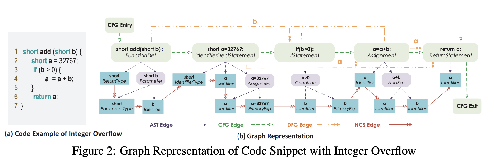
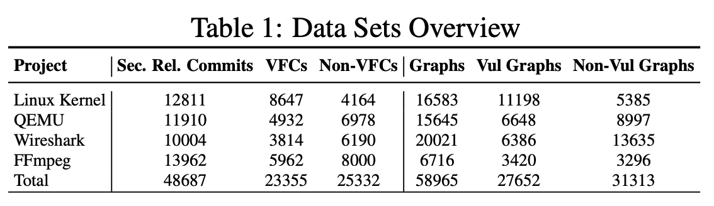
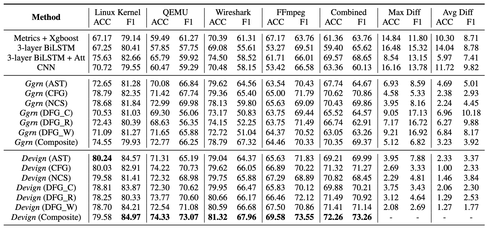
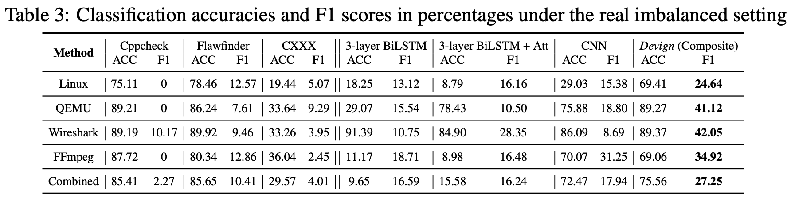

# Graph-based vulnerability detection

## 引入

在漏洞识别方法中，除了一些经典方法（如静态分析、动态分析、符号执行等方法），在应用机器学习方面也取得了许多进展。在早期的机器学习漏洞检测中，人们手工制作特征或模型作为机器学习算法的输入，然而，由于漏洞的根本原因随着漏洞的类型和库而异，用手工制作的方法描述众多库中的所有漏洞是不切实际的。为了提高现有方法的可用性，运用深度神经网络实现更自动化的漏洞识别的方法应运而生。

本文提出了一种基于复合代码表示的图神经网络模型Devign，可以对程序语义信息进行完整的提取，用以各种捕捉漏洞特征。在复合代码表示中，以AST为中心，将不同级别的数据依赖和控制依赖编码为联合图，其中不同类型的边代表不同的依赖特征。这种复合代码表征综合了各种信息，尽可能广泛的捕捉漏洞类型和漏洞模式，使得GNN能够更好的学习节点表征。

提取复合代码表征后，经过门控GNN模块，通过对邻接节点信息的聚合和传递来得到各个节点的表征。最后，经过Conv模块选择与当前任务相关的节点和特征集合，应用一维卷积和dense层来对节点特征进行提取从而实现图级别的分类。

另外，为了验证复合程序编码表征的作用，以及使用GNN进行漏洞检测的效果，本文从4个流行的C库中收集人工标记数据集来进行实验。实验结果表明，Devign比现有方法平均提高了10.51%的准确率和8.68%的F1值，而Conv模块带来了4.66%的精度和6.37%的F1值，将Devign应用到从4个项目中收集到的40个最新的CVE中，得到了74.11%的准确率，在发现新漏洞方面体现了该模型的可用性。

## Devign Model

大多数机器学习或者基于模式的算法在源文件或是应用程序级别预测漏洞，这是一种很粗糙的方式。本文提出的Devign模型则在函数层面上对代码进行二分类（即有或没有漏洞），更为细致和精确。

Devign模型共分为三个部分，分别是：1）复合代码语义的图嵌入层；2）门控图循环层；3）卷积模块

### 图嵌入层（Graph Embedding Layer）

任务：将源代码编码为带有综合程序语意的联合图结构

为了考虑复合代码语义（composite code semantics），在图嵌入层中使用了ASTs、CFG、DFG等经典表示方法，还考虑了源代码的自然顺序（NCS）

#### ASTs

AST（Abstract Syntax Tree）抽象语法树，是源代码的有序树表示，从根节点开始，代码被拆成代码块、语句、声明、表达式等，最后生成的叶节点被称为主令牌（primary token）（蓝色部分是token）

#### CFG

CFG（Control Flow Graph）控制流图，描述了在程序执行过程中可能遍历的所有路径，例如当出现条件语句时（if、for、switch等）要将所有可能得路径标出。（绿色箭头表示CFG）

#### DFG

DFG（Data Flow Graph）数据流图，跟踪整个CFG过程中的变量的访问和修改。（橙色箭头表示DFG）

#### NCS

NCS（Natural Code Sequence）自然代码序列，连接AST的token（叶节点）反映了编程的逻辑。（红色箭头表示NCS）

通过上述方法，可以将函数$c_i$通一个联合图$g$表示。$g$包含了四种类型的子图（或边），共享由AST创建的节点$V = V^{AST}$。对于$V^{AST}$中的每个节点$v$，都包含两个属性：*Code*和*Type*，使用提前训练好的word2vec模型为*Code*编码（word2vec的代码语料库建立在项目中的所有代码文件中），使用label encoding的方法对*Type*进行编码，最终我们可以得到：
$$
g_i(V,X,A) = EMB(c_i),\ \ \forall i \in \{1, \dots, n\}
$$

### 门控制循环层（Gated Graph Recurrent Layers）

任务：聚合邻域信息，得到新的节点表示矩阵

首先，对于任意一个节点$v_i \in V$，初始化一个状态向量（state vector）$h_j^{(1)} = [x_j^\top, \mathbf{0}]^\top \in R^z,z \geq d$。令$T$为总时间步数，则在时间步数$t(t \leq T)$时，$v_j$的新状态
$$
a_{j,p}^{(t-1)} = \mathbf{A}_p^\top(\mathbf{W}_p[h_1^{(t-1)\top}, \dots, h_m^{(t-1)\top}]+b)
$$
其中，$\mathbf{A}_p$是$\mathbf{A}$的第$p$个邻接矩阵（第p个类型边的邻接矩阵），$\mathbf{W}_p$是学习权重，b是偏差。

最后，利用门控循环单元（GRU）得到当前时间的隐藏状态（hidden state）
$$
h_j^{(t)} = GRU(h_J^{(t-1)}, ACC(\{a_{j,p}^{(t-1)}\}_{p=1}^{k}))
$$
其中，$AGG(\cdot)$是一个聚合函数，在这里使用$SUM$；$k$是边类型数。经过T个时间步长后，最终得到的隐藏状态就是最终的节点表示矩阵$H_i^{(T)} = \{h_j^{(T)} \}_{j=1}^m$

### 卷积层（Conv Layer）

任务：利用门控图循环层生成的节点特征做预测

定义函数$\sigma(\cdot) = MAXPOOL(Relu(CONV(\cdot)))$，即在卷积之后做一个maxpooling。假设进行了$l$次卷积
$$
Z_i^{(1)} = \sigma([H_I^{(T)},x_i]) ,\dots ,Z_i^{l} = \sigma(Z_i^{(l-1)})\\
Y_i^{(1)} = \sigma([H_I^{(T)}]) ,\dots ,Y_i^{l} = \sigma(Y_i^{(l-1)})\\
\tilde{y}_i = Sigmoid(AVG(MLP(Z_i^{l}) \odot MLP(Y_i^{l}) ))
$$

## 模型评估

- Q1：Devign相比其他源代码漏洞检测方法，效果如何？
- Q2：Conv模块与普通的flatten的节点融合相比，有什么优势？
- Q3：复合图特征学习相比单一图有哪些优势？
- Q4：在真实场景中，相比于静态分析器，Devign是否有更好的性能？
- Q5：在CVE公开报告的最新漏洞上，Devign的表现如何？

上图是本文使用的数据集示例，本文评估了从4个大型C语言开源项目中收集的手工标记的函数，这些项目在开发人员中很流行，并且功能多样，例如Linux Kernel, QEMU, Wireshark和FFmpeg。

本文利用基于代码属性图的C/C++开源代码分析平台Joern来提取数据集中所有函数的AST和CFG，上图中的Ggrn意思是普通的flatten的节点融合。将DFG图分为3个子图，DFG_C表示变量的定义，DFG_R表示变量的最近一次读取，DFG_W表示变量的最后一次写入。下图展示了Devign模型与BiLSTM，BiLSTM-Attention，CNN，以及两种静态方法进行比较的实验结果。

下面回答之前提出的5个问题：

- Q1：可见Devign相比其他的模型，准确率和F1值都有明显的提高
- Q2：Devign模型与Ggrn模型相比，准确率平均提高3.23%，F1值平均提高3.92%，说明Conv模块提取了更多相关节点和特征用于图级分类
- Q3：对于Ggrn模型，复合图和单一图的区别不大，而对于Devign模型，复合图的效果优于单一图
- Q4：本文创建了一个具有10%漏洞的不平衡数据集，将Devign与著名的开源静态分析工具Cppcheck、Flawfinder和商业工具CXXX进行比较，Devign的F1平均值显著提高，提升幅度达到了27.99%
- Q5：本文分别提取了各个项目的最近的10个CVE漏洞来检查Devign是否可以识别0-day漏洞。通过对40个CVE漏洞的提交修复提取得到112个漏洞函数，将这些函数输入到经过训练的Devign模型中，平均准确率达到了74.11%，显示了Devign在实际应用中发现新漏洞的潜力。
