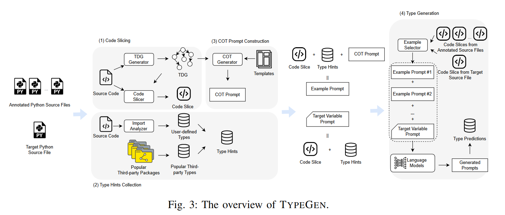

# TypeGen

This is the tool released in the ASE'23 paper "[Generative Type Inference for Python](https://arxiv.org/abs/2307.09163)".
<br />
Github repo: https://github.com/JohnnyPeng18/TypeGen?tab=readme-ov-file
# 代码说明

## 1. 方法流程


个人理解 TypeGen 可以归属为的 prompt 工程，通过在目标变量提示(新问题)之前添加一些感知领域知识的示例提示(示例问题和答案)来构造输入提示，然后利用已有的预训练模型进行类型推断（代码中使用的是 openAi api接口）。<br />

TypeGen 的 prompt 构造主要有三大步骤：（1） Code Slicing （2）Type Hints Collection （3）Chain-of-Thought Prompt Construction 。 代码也是由这几个部分构成。

## 2. 运行说明
注：源仓库中对的代码如何运行已经进行了较为详细的说明，这里主要补充一些复现中涉及到的一些额外信息。

1. config 文件中的 datafile 列举了代码运行所需要的文件，其中 testset.json 和 trainset.json 是必须的(其格式如下)，也就是说将其拓展至新的数据集的话，就需要按照其格式构造新的数据文件，其余中间文件的生成代码都进行相应封装。
```angular2html
{
        "cat": "builtins",
        "file": "repos/007MrNiko/Stepper/about/urls.py",
        "generic": false,
        "gttype": "str",
        "loc": "global@global",
        "name": "app_name",
        "origttype": "builtins.str",
        "processed_gttype": "str",
        "scope": "local",
        "type_depth": 0
    }
```
2. 代码切分：代码切分主要是根据 HiTyper 工具生成 type dependency graph， 在此基础上进行清理，保留关键节点，最后根据剩余节点切分得到目标变量相关的代码片。具体对应 slice.py 和 ast_operation.py 中的内容。
3. 类型提示：论文中提到 typeGen 利用了常见的第三方库中的类型知识，以及分析了源文件中的用户自定义的类型，这些同样是通过 HiTyper实现，生成对应的 testset_usertypes.json 等文件；
4. COT 生成：其是利用 TDG 的信息填充作者总结的 COT 模板进行生成的。生成规则论文 table I 有说明，具体实现在 cot.py 文件中, 生成的部分内容如下：
```angular2html
"repos/007MrNiko/Stepper/accounts/tests.py--test_empty_password@LoginFormTests--form--local": 
    "First, the variable form is assigned from a function call LoginForm. 
    Second, the argument of the function call LoginForm is a dict. 
    Third, the keys of the dict are a str and a str. The values of the dict are a str and a str. 
    Therefore, the type of the variable form is `LoginForm`."
```
综上，该方法的核心就是构造具有领域知识的 prompt, 由代码切片、类型提示、COT提示组成，以此利用预训练语言模型完成类型推断工作。代码完整，难点在复现到新数据时需要按其格式构造新的数据文件。

## Cite

```
@misc{peng2023generative,
      title={Generative Type Inference for Python}, 
      author={Yun Peng and Chaozheng Wang and Wenxuan Wang and Cuiyun Gao and Michael R. Lyu},
      year={2023},
      eprint={2307.09163},
      archivePrefix={arXiv},
      primaryClass={cs.SE}
}
```

