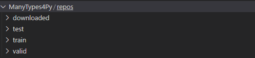
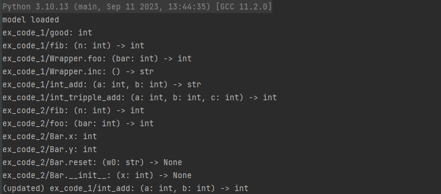
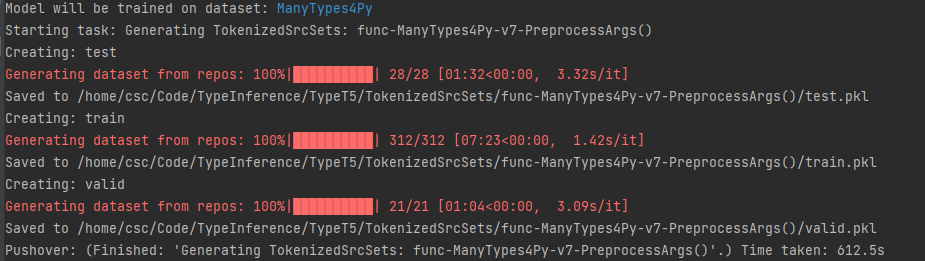
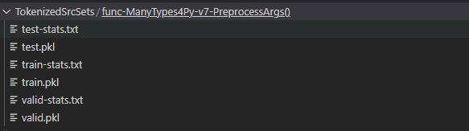

# TypeT5: Seq2seq Type Inference using Static Analysis


This repo contains the source code for the paper [TypeT5: Seq2seq Type Inference using Static Analysis](https://openreview.net/forum?id=4TyNEhI2GdN&noteId=EX_-kP9xah).

```
@inproceedings{Wei2023TypeT5,
    title={TypeT5: Seq2seq Type Inference using Static Analysis},
    author={Jiayi Wei and Greg Durrett and Isil Dillig},
    booktitle={International Conference on Learning Representations},
    year={2023},
    url={https://openreview.net/forum?id=4TyNEhI2GdN}
}
```

源代码仓库地址：https://github.com/utopia-group/TypeT5 ，

## 一、基本文件夹说明
* config：根目录配置文件
* data：演示模型时的输入样例代码以及训练模型时所用的github 仓库信息
* MrVPlusOne: 从huggingFace 上下载的训练好的开源模型
* scripts: 模型调用代码，包括模型训练、微调、实验代码
* src： 模型基础的源代码

## 二、scripts 基本内容说明
 注意：*.ipynb 文件为开源代码内容（可能无法直接运行），*.py 文件为本人根据代码实际运行情况，注释、修改的代码，基本说明如下：
 
* collect_dataset.py: 下载开源的 github 仓库作为模型的训练数据，并进行简单筛选，数据集保存在 ManyTypes4Py 文件夹下
* prepare_dataset.py: 将划分的数据集划分为训练集、验证集、测试集

* run_typet5.py:加载已有模型并对进行使用, 测试效果如下：

* train_model.py: 训练模型（包括对数据集进行 tokenize）



## 三、代码运行说明
首先参照源仓库中的 readme 配置环境；但仓库中缺少训练数据文件、部分配置文件以及存
在一些无关紧要的代码使用错误，导致下载后无法直接运行，可按照以下方式进行尝试。（修改补充内容见代码注释，其中代码涉及的路径可能需要根据本地情况进行调整）
### 3.1 训练新模型
1. 运行 collect_dataset.py 下载模型训练数据集
2. 运行 prepare_dataset.py 划分数据集
3. 运行 train_model.py 重新训练数据集

### 3.2 使用预训练模型
1. 在 hugging face 上下载模型：https://huggingface.co/MrVPlusOne/TypeT5-v7/tree/main
2. 运行 run_typet5.py 使用模型

